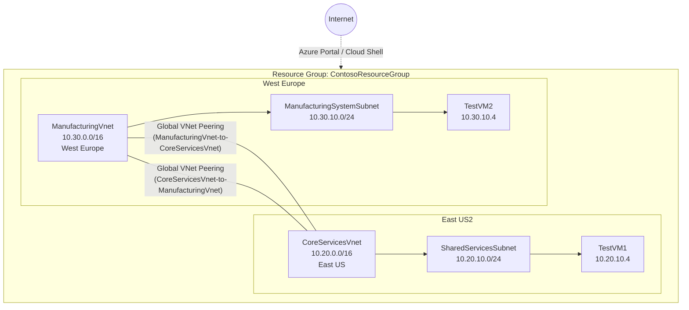

# Connect two Azure Virtual Networks using Global Virtual Network Peering  

# Overview

This exercise demonstrates how to connect two Azure Virtual Networks across different regions using **Global Virtual Network Peering**. Unlike regional peering, global peering links VNets across Azure regions without requiring a gateway, enabling low-latency private connectivity over the Microsoft backbone network.

# Learning Objectives

- Create two Virtual Networks in **different Azure regions**
- Configure **Global VNet Peering** in both directions (bidirectional)
- Verify connectivity between resources in peered networks
- Understand peering states: *Initiated → Connected*

---

# Architecture



---

# 1. Create a VM to test the configuration

Test VM on the Manufacturing VNet

Azure CLI / PowerShell Commands:

```
PS $RGName = "ContosoResourceGroup"
PS New-AzResourceGroupDeployment -ResourceGroupName $RGName -TemplateFile ManufacturingVMazuredeploy.json -TemplateParameterFile ManufacturingVMazuredeploy.parameters.json

```


Figure 1 - VM successfully created

---

# 2. Connect to the test VMs using RDP


Figure 2 - Connected remotely to both VMs

---

# 3. Test the connection between the VMs

Testing the network connection between the two VMs over port 3389 (RDP)

Azure CLI / PowerShell Command:

```
PS Test-NetConnection 10.20.20.4 -port 3389
```


Figure 3 - Failed connection test between the VMs

---

# 4. Create VNet peerings between CoreServicesVnet and ManufacturingVnet

CoreServicesVNet to ManufacturingVNet successfully, fully synchronised and connected


Figure 4 - VNet Peerings configured between CoreServicesVnet & ManufacturingVnet

---

# 5. Test connection between the VMs

Azure CLI / PowerShell Command:

```
PS Test-NetConnection 10.20.20.4 -port 3389
```

Figure 5  - Connection test succeeded

---

# Key Concepts Demonstrated

| Concept | Detail |
|---|---|
| **Global VNet Peering** | Links VNets across different Azure regions |
| **Peering Direction** | Must be configured on **both** VNets (bidirectional) |
| **Address Space** | Must be non-overlapping (`10.20.x.x` vs `10.30.x.x`) |
| **Traffic Path** | Travels over Microsoft backbone — not the public internet |
| **Peering States** | `Initiated` → `Connected` (both sides must connect) |
| **No Gateway Required** | Global peering doesn't need a VPN or ExpressRoute gateway |

---

# Cleanup

>  Remember to delete resources after the exercise to avoid charges.

Azure CLI / PowerShell Command:

```
Remove-AzResourceGroup -Name 'ContosoResourceGroup' -Force -AsJob
```

---

# References

- [Azure VNet Peering — Microsoft Docs](https://learn.microsoft.com/en-us/azure/virtual-network/virtual-network-peering-overview)
- [AZ-700 Learning Path on Microsoft Learn](https://learn.microsoft.com/en-us/training/paths/design-implement-microsoft-azure-networking-solutions-az-700/)
- [Global VNet Peering FAQ](https://learn.microsoft.com/en-us/azure/virtual-network/virtual-networks-faq#what-are-the-constraints-related-to-global-vnet-peering-and-load-balancers)
